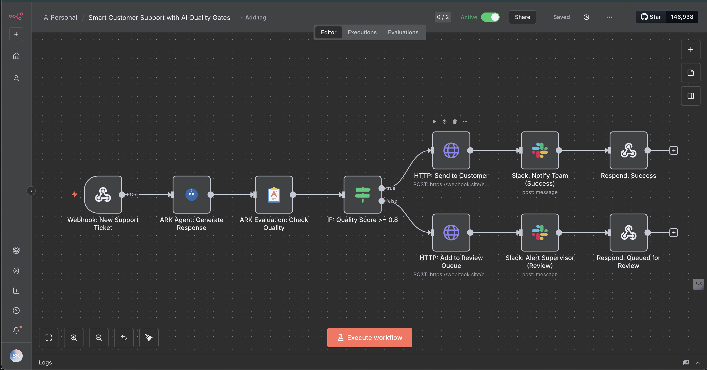
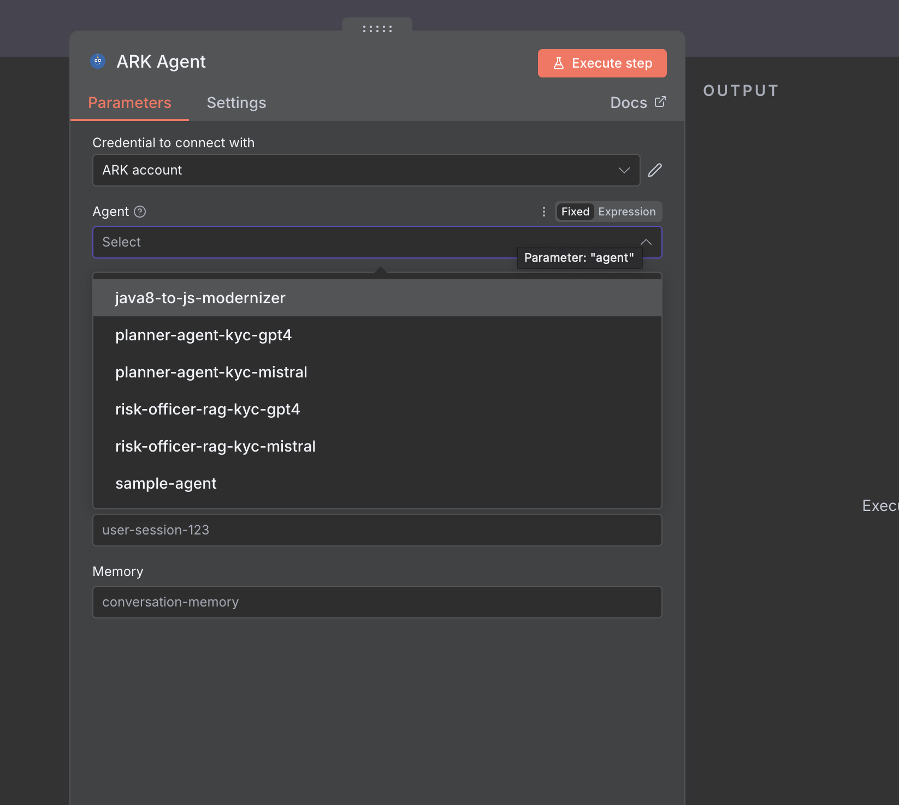

# How Visual Workflow Tools Can Compose Enterprise AI Infrastructure

*Bridging the gap between AI teams and business operations with ARK + n8n*

---

It's 2 AM. Your fintech company's customer support bot just told a frustrated enterprise client to "try turning off your firewall" to fix a login issue. The client escalated to your CEO. Your team discovers the AI agent hallucinated a solution because nobody set up quality checks. This isn't a hypothetical—it's the reality for teams deploying AI agents without governance.

Agentic workflows are reshaping business operations: automated ticket triage in SaaS help desks, dynamic contract review in legal ops, personalized marketing at scale, and automated invoice reconciliation. But most organizations hit the same wall: **AI teams and operations teams work in separate systems, unable to collaborate effectively.**

AI teams manage agents and models in code repositories. Operations teams build workflows in visual tools like n8n, Zapier, or Power Automate. Connecting them requires custom integration code, duplicate configuration, and constant coordination between teams with different tools and expertise.

## The Problem with Embedded AI Logic

Most workflow automation platforms—including n8n—let you call LLMs directly. You can add an OpenAI node to your workflow, pass it a prompt, and route based on the response. This works for simple use cases.

But as AI workflows scale across an organization, teams hit practical limits:

**Embedded AI logic creates duplication**
- Each workflow duplicates agent prompts and evaluation criteria
- Ten workflows using the same "customer support agent" means ten places to update prompts
- Evaluation logic (quality dimensions, scoring rubrics) lives inside workflows, not as reusable infrastructure
- No central source of truth for what agents exist or how they're configured

**No separation between AI management and workflow composition**
- Data scientists tune prompts by editing workflows
- Operations teams can't adjust quality thresholds without understanding prompt engineering
- Changes to agent behavior require redeploying workflows
- Versioning happens at the workflow level, not the agent level

The gap isn't that workflow tools lack AI capabilities—it's that **AI logic isn't managed as reusable infrastructure**. You end up with duplicated prompts, inconsistent evaluation criteria, and tight coupling between AI configuration and business workflows.

## A Different Approach: Composable AI Infrastructure

We extended n8n—an open-source workflow automation platform with 400+ pre-built integrations—with ARK, a platform that manages AI agents, models, and evaluators as reusable infrastructure.

The key insight: **both platforms were designed for composability**. n8n exposes custom nodes for any API. ARK exposes agents and evaluators through APIs. The integration happened naturally because both systems embraced extensibility as a core design principle.

*This workflow generates customer support responses, evaluates them for quality, and routes automatically—all without code.*

## How It Works in Practice

Let's walk through a customer support example:

**Alice Johnson submits a ticket**: "I cannot access the API dashboard. When I try to log in, I get a 403 error."

**The workflow**:
1. **Webhook receives ticket** with customer context (Enterprise account, high priority)
2. **AI agent generates response** using a reusable agent managed by the AI team
3. **Quality evaluator scores the response** across five dimensions: relevance, accuracy, clarity, usefulness, compliance
4. **Conditional routing**: If score ≥ 0.8, auto-send to customer; otherwise, route to human review queue

*Operations teams select agents from a dropdown—no code required. When AI teams deploy new agents, they automatically appear in the list.*

**Alice's response scores 0.92** (high relevance, accurate steps, professional tone). The system auto-sends it within 7 seconds.

**Bob's vague ticket** ("Why is everything broken?") produces a generic response scoring 0.65. The workflow automatically routes it to human review with the evaluation reasoning attached, so the reviewer knows exactly what to improve.

## Why This Matters: Separation of Concerns

The integration enables two teams to work independently:

**Operations teams** (in n8n):
- Adjust quality thresholds based on score distributions
- Modify notification logic
- Add new business system integrations
- Change routing rules for different customer segments
- Deploy workflow changes instantly

**AI teams** (managing infrastructure):
- Tune agent prompts based on failure patterns
- Update evaluation criteria
- Switch underlying models for cost or performance
- Add new capabilities like memory or tool access
- Version and rollback changes through standard deployment practices

**No coordination overhead**. Operations teams don't wait for engineering to adjust a threshold. AI teams don't get tickets asking them to "add a Slack notification." Each team uses their own tools, working at their own pace.

## Potential Impact: A Fintech Example

Consider how this pattern could apply to customer support at a fintech company handling account inquiries:

**Without quality gates**: All AI-generated responses go to human review. Average resolution time: 45 minutes. Review queue: 200+ tickets daily. Agents provide no operational leverage.

**With quality-gated workflows**: The system scores each response across dimensions like relevance, accuracy, and compliance with financial regulations. Set the threshold at 0.8.

**Possible outcomes**:
- Straightforward questions (password resets, balance inquiries, transaction explanations) likely score high and auto-send
- Ambiguous questions, account-specific edge cases, or policy exceptions likely score lower and route to review
- Human reviewers focus on complex cases that truly require judgment, not routine issues
- Resolution time drops significantly for auto-approved responses
- Review queue shrinks to genuine edge cases

The economics shift: instead of reviewing every AI response, teams review only the uncertain ones—improving both speed and quality.

## The Architectural Pattern

This showcases a broader pattern: **composable AI infrastructure**.

When AI capabilities are managed as reusable infrastructure rather than workflow-specific code, organizations gain:

**Resource Reuse**: One agent serves multiple workflows, APIs, Slack bots, and scheduled jobs. Update the agent's instructions once; all consumers get the change automatically.

**Independent Scaling**: AI execution capacity scales separately from workflow execution. Add agent pods during peak hours without redeploying workflows.

**Role-Based Ownership**: Technical teams own AI infrastructure; business teams own workflows. Clear boundaries reduce coordination overhead.

**Governance Through Architecture**: Quality evaluation and model management happen at the infrastructure layer, enforced consistently across all workflows.

The same principle extends beyond n8n. Because AI resources expose through APIs, they compose with any tool: API gateways, Slack bots, scheduled jobs, custom frontends. The pattern is tool-agnostic.

## What's Required

This approach requires:
- AI infrastructure that exposes agents and evaluators as queryable resources
- Workflow tools that support custom integrations
- Teams willing to separate concerns (AI infrastructure vs. business workflows)
- Clear ownership boundaries between technical and operations teams

The technical implementation (Kubernetes, API design, node development) is detailed in a [companion article](./ARTICLE_TECHNICAL.md) for platform engineers.

## Getting Started

The complete example—including the workflow, agent definitions, and deployment instructions—is open source: [github.com/mckinsey/agents-at-scale-ark](https://github.com/mckinsey/agents-at-scale-ark)

Start with one workflow. Prove that operations teams can compose AI capabilities without managing their lifecycle. Expand once you see the same agent serving multiple consumers without code changes.

The first step: separate AI infrastructure from business workflows. The rest follows naturally from composability.

---

**Additional Resources**

- **ARK Documentation**: [mckinsey.github.io/agents-at-scale-ark](https://mckinsey.github.io/agents-at-scale-ark)
- **Agentic AI Mesh Architecture**: [Medium Post](https://medium.com/quantumblack/how-we-enabled-agents-at-scale-in-the-enterprise-with-the-agentic-ai-mesh-architecture-baf4290daf48)
- **Technical Implementation Guide**: [ARTICLE_TECHNICAL.md](./ARTICLE_TECHNICAL.md)

**Tags**: #AI #Automation #Enterprise #Workflows #AgenticAI #Composability
