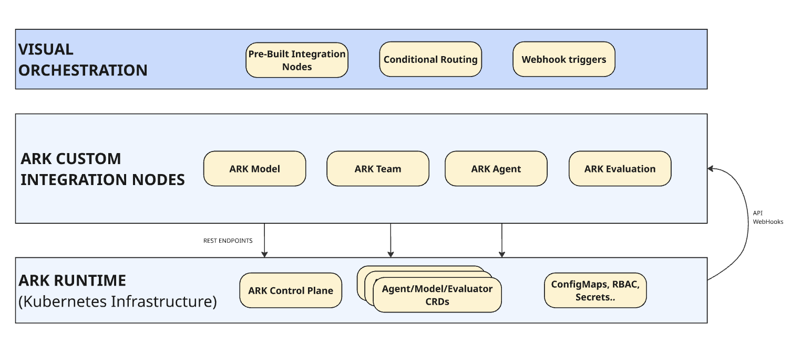
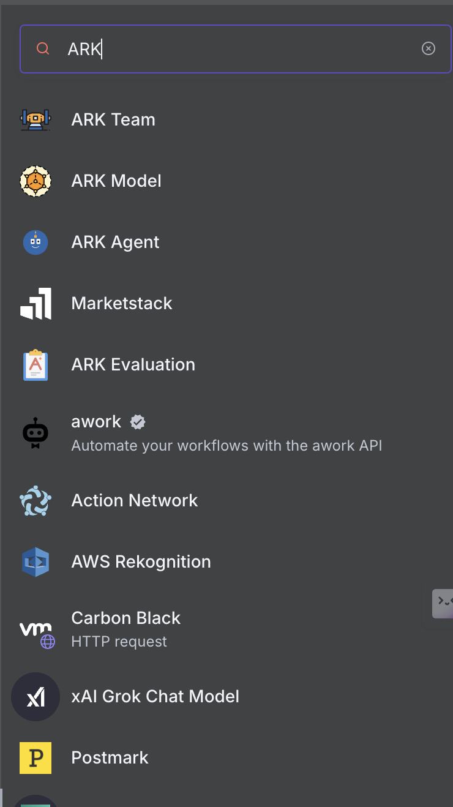
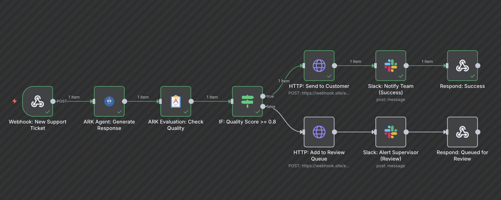

# Bringing an Agentic AI Mesh-style Governance to Non-technical Stakeholders with n8n

*How ARK + n8n enables visual composition of enterprise AI infrastructure*

---

It's 2 AM. Your fintech company's customer support bot just told a frustrated enterprise client to "try turning off your firewall" to fix a login issue. The client escalated to your CEO. Your team discovers the AI agent hallucinated a solution because nobody set up quality checks. This isn't a hypothetical—it's the reality for teams deploying AI agents without governance.

Agentic workflows are reshaping how businesses add intelligence to day-to-day processes: automated ticket triage in SaaS help desks, dynamic contract review in legal ops, personalized marketing at scale, and automated invoice reconciliation. The pattern is universal: AI-powered decision logic that needs to be **safe, scalable, and editable by business teams**—not just engineers.

But there's a persistent gap: AI capabilities and business workflows live in separate systems. AI teams manage agents, prompts, and models in notebooks or Python repos. Operations teams manage workflows and integrations in tools like n8n, Zapier, or Power Automate. Connecting them requires custom API glue code, duplicate configuration, or manual handoffs between teams.

This isn't a tooling problem—it's an architectural one. AI frameworks provide agent execution but lack visual workflow composition. Workflow platforms provide integrations but lack AI lifecycle management (prompt versioning, quality evaluation, model abstraction). Most teams pick one side and compromise on the other.

We took a different approach: extend n8n—which offers 400+ pre-built integrations—with ARK, a Kubernetes-native AI runtime that manages agents, models, and evaluators as infrastructure. Both platforms were designed with composability and extensibility at their core, which enabled this integration naturally. Technical teams manage AI resources declaratively in ARK; business teams compose workflows visually in n8n.

## The Agentic AI Mesh Architecture

In a [prior post](https://medium.com/quantumblack/how-we-enabled-agents-at-scale-in-the-enterprise-with-the-agentic-ai-mesh-architecture-baf4290daf48), we described the **Agentic AI Mesh architecture**: principles for managing complexity as AI solutions scale in production across systems. **ARK (Agents at Scale)** implements these principles with four core capabilities:

| MESH PRINCIPLE | HOW ARK IMPLEMENTS IT |
|----------------|----------------------|
| **Discoverability** | Agents, models, evaluators exposed as Kubernetes CRDs; any system can list or query them |
| **Reusability** | One agent definition serves dozens of workflows, APIs, scheduled jobs |
| **Scalability** | Pods autoscale per workload; evaluation capacity independent from agent execution |
| **Orchestration** | ARK Operator manages consistent state and cross-resource dependencies |

Since every ARK component exposes through APIs, underlying resources (agents, models, MCP servers, tools, evaluations) become consumable by third-party services, frontends, and low-code workflow editors. This is where n8n enters: **business users compose workflows visually, connecting ARK's governed AI infrastructure with business systems—all without touching Kubernetes.**



## How It Works: Four Building Blocks

We extended n8n with four custom nodes that expose ARK resources as workflow primitives:



*The ARK nodes appear in n8n's node palette, searchable by typing "ARK". Each node type connects to ARK's API to list available resources from your Kubernetes cluster.*

- **ARK Agent** — Execute agents with declarative instructions, model references, tool access
- **ARK Model** — Switch LLM providers (OpenAI, Azure, Anthropic, Bedrock) without workflow changes
- **ARK Evaluation** — Quality scoring with configurable dimensions and thresholds
- **ARK Team** — Multi-agent coordination with role-based delegation

These nodes turn ARK resources into visual workflow elements. Let's see how ARK Agent and ARK Evaluation work in practice.

## Customer Support with Quality Gates: A Walkthrough

We'll demonstrate the integration through a customer support workflow—a common scenario where AI agents generate responses that need quality checks before reaching customers. The workflow follows a simple pattern:

**receive ticket → generate response → evaluate quality → route based on score**

Let's follow Alice Johnson's support ticket through the system:


*The workflow canvas shows the complete flow. Notice the IF node branches into two paths based on the evaluation score: the top path (TRUE) handles high-quality responses, while the bottom path (FALSE) routes to human review. Green checkmarks indicate this execution took the success path.*

**1. Ticket Arrives**

Alice submits a support ticket: "I cannot access the API dashboard. When I try to log in, I get a 403 error."

The webhook trigger receives her ticket with context (Enterprise account, high priority) and forwards it to the agent.

**2. Agent Generates Response**

The `support-agent` is a reusable ARK resource deployed to Kubernetes. The n8n node references it by name—platform teams can update the agent's instructions without touching the workflow.


*The Agent dropdown shows all available agents from your Kubernetes cluster. This list is populated dynamically by querying the ARK API—when platform teams deploy new agents, they automatically appear here. Notice the "Fixed/Expression" toggle allowing either static selection or dynamic expressions like `{{ $json.agent_type }}_agent` for runtime routing. The Session ID and Memory fields enable conversation persistence across multiple interactions.*

The agent is configured with clear behavioral guidelines:

```yaml
apiVersion: ark.mckinsey.com/v1alpha1
kind: Agent
metadata:
  name: support-agent
spec:
  description: "AI agent specialized in customer support"
  prompt: |
    You are a customer support specialist. Analyze issues carefully,
    provide clear solutions, maintain professional tone.
    Keep responses concise (2-3 paragraphs).
  modelRef:
    name: default
```

The workflow composes a context-rich prompt from Alice's ticket using n8n expressions:


*The Input field uses n8n's expression syntax `{{ $json.body.field }}` to pull data from the webhook trigger. This composability pattern lets workflows dynamically construct prompts based on incoming data—no hard-coding required. The "Wait for Completion" toggle tells n8n to poll the ARK API until the agent finishes executing (typically 2-5 seconds for text generation).*

Within 3 seconds, the agent generates a response explaining the 403 error and providing troubleshooting steps.

**3. Quality Evaluation**

Before reaching Alice, the response passes through the `support-quality-evaluator`:

![ARK Evaluation node split view showing: Left panel displays input from previous node (customer issue and agent response). Middle panel shows Parameters with Evaluator dropdown set to "support-quality-evaluator", Input and Output fields using expressions to reference previous nodes, and an "Advanced Parameters" section expanded showing: Evaluation Scope with five badges selected (Relevance, Accuracy, Clarity, Usefulness, Compliance), Minimum Score field set to 0.80, and Temperature field. Right panel shows JSON output with the evaluation result including metadata.](./image/4_ark_evaluation.png)

*The critical detail here is the "Advanced Parameters" section. The Evaluation Scope is a multi-select field where business users can customize which dimensions matter for their use case—you might evaluate only "Accuracy" and "Compliance" for regulatory responses, or add "Tone" for customer-facing content. The Minimum Score (0.80) acts as the quality gate threshold. Notice how both Input and Output fields use expressions `{{ $('Webhook Trigger').item.json.body.issue }}` and `{{ $('ARK Agent: Generate Response').item.json.response }}` to reference data from previous nodes—this is how n8n chains workflow steps together.*

**4. Conditional Routing**


*The IF node uses `parseFloat($json.status.score)` to extract the numeric score from the evaluation result, then compares it against 0.8. This is standard n8n conditional logic—business users familiar with spreadsheet formulas can modify this threshold without understanding the underlying ARK API. The left panel shows the evaluation result structure, helping users understand what data is available for routing decisions.*

Alice's response scores 0.92—high relevance, accurate steps, professional tone:



*Green checkmarks across all nodes confirm successful execution. The workflow took the TRUE branch (top path), indicating the quality score met the threshold. This visual feedback helps operators quickly verify that high-quality responses are flowing through the auto-approval path.*

![ARK Evaluation node output panel showing metadata with: evaluation.metadata/criteria showing "relevance=1, accuracy=1, clarity=1, usefulness=1, compliance=1", evaluation.metadata/evaluators showing "relevance,accuracy,clarity,usefulness,compliance", evaluation.metadata/min_score: 0.8, and evaluation.metadata/reasoning containing detailed text: "The response directly addresses the user's issue with a 403 error on the API dashboard, explaining the typical cause and providing clear, step-by-step troubleshooting steps. It is factually accurate, clear, and helpful, and it offers escalation if the problem persists. The tone is professional and appropriate for customer support, fully complying with scope requirements."](./image/7_successful_evaluation.png)

*The evaluation output includes both quantitative scores (all dimensions scored 1.0, indicating perfect performance) and qualitative reasoning explaining why the response passed. This reasoning is crucial for operators reviewing edge cases—they can see exactly which aspects passed or failed, enabling them to improve agent prompts or evaluation criteria based on patterns.*

**Result**: The response auto-sends to Alice. Total time from ticket to reply: 7 seconds.

### When Quality Gates Catch Issues

Compare this to Bob's vague ticket: "Why is everything broken?"

The agent generates a generic response. The evaluator scores it 0.65—low relevance, insufficient specificity. The workflow automatically:
- Routes draft to human review queue
- Alerts supervisor with evaluation reasoning
- Updates ticket status to "Pending Review"

The workflow routes the draft to the review queue. The human reviewer sees the evaluation score and reasoning, then crafts a targeted response asking Bob for details.

### How Teams Use It

Because ARK and n8n have separate responsibilities, teams can iterate independently:

**Business users** (in n8n):
- Adjust quality thresholds after observing score distribution
- Modify Slack notification logic
- Add ticketing system integrations
- Change routing rules for priority customers

**Technical teams** (in Kubernetes YAML):
- Tune agent prompts based on failure patterns
- Update evaluation criteria (add "tone compliance" dimension)
- Switch underlying model for cost savings
- Add memory persistence for multi-turn conversations

**Each team iterates at their own pace with their own tools.** No coordination overhead, no deployment dependencies, no workflow rewrites.

## Getting Started

Deploy the example workflow to your Kubernetes cluster:

```bash
git clone https://github.com/mckinsey/agents-at-scale-ark
cd agents-at-scale-ark
make quickstart                    # Start ARK operator
make n8n-install                   # Deploy n8n with ARK nodes
kubectl apply -f services/n8n/article/  # Deploy example resources
```

Import `services/n8n/article/n8n-workflow.json` into n8n, configure ARK API credentials, and test with a support ticket.

Full setup guide: [services/n8n/article/README.md](https://github.com/mckinsey/agents-at-scale-ark/tree/main/services/n8n/article)

## What We Learned

This integration showcases the Agentic AI Mesh in action: composability and extensibility as architectural patterns enable separation of concerns. ARK manages AI resources as infrastructure; n8n composes those resources into visual workflows. Technical teams maintain agents declaratively; business teams reference them without managing their lifecycle.

The same ARK agent can serve multiple n8n workflows, API endpoints, Slack bots, or scheduled jobs. When you update an agent's prompt or switch its underlying model, all consumers get the change—no workflow rewrites needed.

**Try the example today**: [github.com/mckinsey/agents-at-scale-ark](https://github.com/mckinsey/agents-at-scale-ark)

---

**Additional Resources**

- **ARK Documentation**: [mckinsey.github.io/agents-at-scale-ark](https://mckinsey.github.io/agents-at-scale-ark)
- **Agentic AI Mesh Architecture**: [Medium Post](https://medium.com/quantumblack/how-we-enabled-agents-at-scale-in-the-enterprise-with-the-agentic-ai-mesh-architecture-baf4290daf48)
- **Reference Workflow**: [services/n8n/article/](https://github.com/mckinsey/agents-at-scale-ark/tree/main/services/n8n/article)

**Tags**: #AI #Kubernetes #n8n #Agents #LLM #Evaluation #MLOps #Automation #AgenticAI #EnterpriseArchitecture
