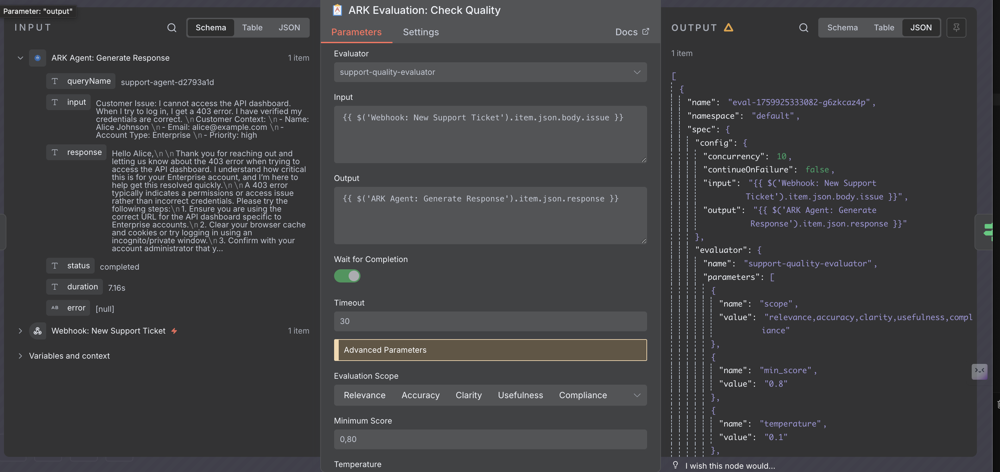
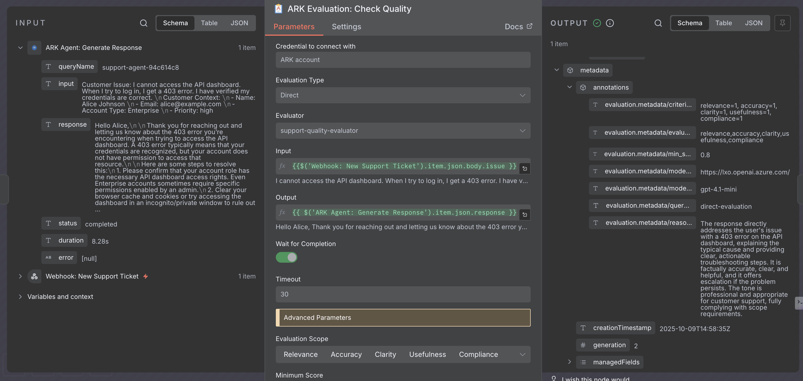
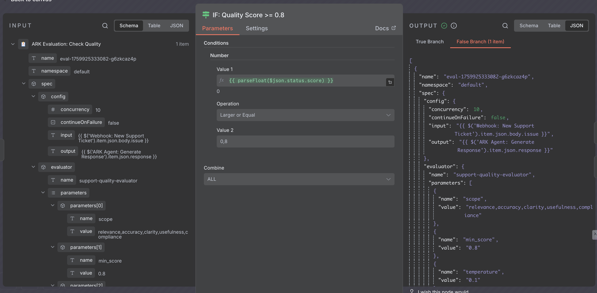

# Integrating ARK with n8n: Implementation Guide

*A technical walkthrough of building custom n8n nodes that expose Kubernetes-native AI infrastructure*

---

This guide demonstrates how we extended n8n with custom nodes that reference ARK resources (agents, models, evaluators) deployed on Kubernetes. If you're looking for the strategic overview and business value, see the [executive article](./ARTICLE_EXECUTIVE.md).

**What you'll learn**:
- How ARK exposes AI resources through REST APIs
- How to build n8n custom nodes with resource locators
- Deployment patterns for the integrated system
- Configuration and troubleshooting

## Architecture Overview

ARK implements the [Agentic AI Mesh architecture](https://medium.com/quantumblack/how-we-enabled-agents-at-scale-in-the-enterprise-with-the-agentic-ai-mesh-architecture-baf4290daf48) with four core primitives exposed as Kubernetes Custom Resource Definitions (CRDs):

| RESOURCE | PURPOSE | API ENDPOINT |
|----------|---------|--------------|
| **Agent** | AI agent with instructions, model reference, tool access | `/v1/agents`, `/v1/agents/{name}` |
| **Model** | Multi-provider LLM abstraction (OpenAI, Azure, Anthropic, Bedrock) | `/v1/models`, `/v1/models/{name}` |
| **Evaluator** | Quality scoring with configurable dimensions | `/v1/evaluators`, `/v1/evaluators/{name}` |
| **Team** | Multi-agent coordination with role-based delegation | `/v1/teams`, `/v1/teams/{name}` |

The ARK API serves these resources over HTTP, enabling any tool to query and execute them. n8n custom nodes call these endpoints and present the resources as visual workflow elements.


## Custom n8n Node Implementation

We built four custom nodes as a standard n8n community package. Each node follows the same pattern:

### Node Structure

```
services/n8n/nodes/
├── package.json                    # npm package metadata
├── credentials/
│   └── ArkApi.credentials.ts       # ARK API connection config
└── nodes/
    ├── ArkAgent/
    │   └── ArkAgent.node.ts        # Agent execution node
    ├── ArkModel/
    │   └── ArkModel.node.ts        # Model query node
    ├── ArkEvaluation/
    │   └── ArkEvaluation.node.ts   # Evaluation execution node
    └── ArkTeam/
        └── ArkTeam.node.ts         # Team coordination node
```

### Key Implementation Patterns

#### 1. Resource Locators (Dynamic Dropdowns)

The Agent node uses n8n's resource locator pattern to populate dropdowns from the ARK API:

```typescript
{
  displayName: 'Agent',
  name: 'agent',
  type: 'resourceLocator',
  default: { mode: 'list', value: '' },
  required: true,
  modes: [
    {
      displayName: 'From List',
      name: 'list',
      type: 'list',
      typeOptions: {
        searchListMethod: 'searchAgents',
        searchable: true,
      },
    },
    {
      displayName: 'By Name',
      name: 'name',
      type: 'string',
      placeholder: 'e.g. support-agent',
    },
  ],
}
```

The `searchAgents` method queries the ARK API:

```typescript
async searchAgents(this: ILoadOptionsFunctions): Promise<INodeListSearchResult> {
  const credentials = await this.getCredentials('arkApi');
  const baseUrl = credentials.baseUrl as string;

  const response = await this.helpers.request({
    method: 'GET',
    url: `${baseUrl}/v1/agents`,
    json: true,
  });

  return {
    results: response.items.map((agent: any) => ({
      name: agent.metadata.name,
      value: agent.metadata.name,
    })),
  };
}
```

This pattern enables both static selection (pick from dropdown) and dynamic expressions (`{{ $json.agent_type }}_agent`) for runtime routing.

#### 2. Query Execution with Polling

When executing an agent, the node creates a Query resource and polls for completion:

```typescript
// Create query
const queryResponse = await this.helpers.request({
  method: 'POST',
  url: `${baseUrl}/v1/queries`,
  json: true,
  body: {
    metadata: { generateName: `${agentName}-` },
    spec: {
      agent: { name: agentName },
      input: inputText,
      sessionId: sessionId || undefined,
      memory: memory || undefined,
    },
  },
});

const queryName = queryResponse.metadata.name;

// Poll for completion
let phase = '';
let attempts = 0;
const maxAttempts = Math.floor(timeout / 2000);

while (phase !== 'done' && phase !== 'failed' && phase !== 'error' && attempts < maxAttempts) {
  await new Promise(resolve => setTimeout(resolve, 2000));

  const statusResponse = await this.helpers.request({
    method: 'GET',
    url: `${baseUrl}/v1/queries/${encodeURIComponent(queryName)}`,
    json: true,
  });

  phase = statusResponse.status?.phase?.toLowerCase() || '';
  attempts++;
}

if (phase === 'done') {
  return {
    queryName,
    response: statusResponse.status.response,
    status: 'completed',
  };
} else if (phase === 'failed' || phase === 'error') {
  throw new Error(`Agent execution failed: ${statusResponse.status.message}`);
} else {
  throw new Error(`Agent execution timed out after ${timeout}ms`);
}
```

**Key details**:
- Query names with special characters (dots, slashes) must be URL-encoded
- ARK uses lowercase phase values: `done`, `failed`, `error`
- Polling interval (2 seconds) balances responsiveness vs. API load
- Timeout configurable per node (default: 300s)

#### 3. Evaluation with Advanced Parameters

The Evaluation node supports both direct evaluation (input/output pairs) and query evaluation (assessing historical interactions):



```typescript
{
  displayName: 'Advanced Parameters',
  name: 'advancedParameters',
  type: 'collection',
  default: {},
  options: [
    {
      displayName: 'Evaluation Scope',
      name: 'scope',
      type: 'multiOptions',
      options: [
        { name: 'Relevance', value: 'relevance' },
        { name: 'Accuracy', value: 'accuracy' },
        { name: 'Clarity', value: 'clarity' },
        { name: 'Usefulness', value: 'usefulness' },
        { name: 'Compliance', value: 'compliance' },
        { name: 'Faithfulness', value: 'faithfulness' },
      ],
      default: [],
      description: 'Specific dimensions to evaluate',
    },
    {
      displayName: 'Minimum Score',
      name: 'minScore',
      type: 'number',
      default: 0.7,
      description: 'Minimum acceptable score (0.0-1.0)',
    },
    {
      displayName: 'Temperature',
      name: 'temperature',
      type: 'number',
      default: 0.0,
      description: 'Evaluation temperature (0.0 = strict, 1.0 = lenient)',
    },
  ],
}
```

These parameters map to ARK's evaluation API:

```typescript
const evaluationBody = {
  metadata: { generateName: `${evaluatorName}-` },
  spec: {
    evaluator: { name: evaluatorName },
    input: inputText,
    output: outputText,
    parameters: [
      { name: 'scope', value: scope.join(',') },
      { name: 'min_score', value: minScore.toString() },
      { name: 'temperature', value: temperature.toString() },
      { name: 'context', value: context || '' },
    ],
  },
};
```

## Deployment

### Prerequisites

- Kubernetes cluster (local: minikube, cloud: EKS/AKS/GKE)
- kubectl configured
- helm 3.x

### Deploy ARK Operator

```bash
# Clone the repository
git clone https://github.com/mckinsey/agents-at-scale-ark
cd agents-at-scale-ark

# Deploy ARK operator and dependencies
make quickstart

# Verify ARK components are running
kubectl get pods -n ark-system
```

Expected output:
```
NAME                                      READY   STATUS    RESTARTS   AGE
ark-controller-manager-7d5c8f9b4d-xyz     2/2     Running   0          2m
ark-api-6b7c5d8f9c-abc                   1/1     Running   0          2m
ark-evaluator-5f8c6d7b9a-def             1/1     Running   0          2m
```

### Deploy n8n with ARK Nodes

```bash
# Install n8n with custom ARK nodes
make n8n-install

# Access n8n UI
open http://n8n.default.127.0.0.1.nip.io:8080
```

The `n8n-install` target:
1. Builds the custom nodes package (`services/n8n/nodes`)
2. Creates a Docker image with n8n + ARK nodes
3. Deploys to Kubernetes with Helm
4. Exposes n8n via ingress

### Deploy Example Resources

```bash
# Deploy agent and evaluator
kubectl apply -f services/n8n/article/01-agent.yaml
kubectl apply -f services/n8n/article/02-evaluator.yaml

# Verify resources are ready
kubectl get agent,evaluator
```

Expected output:
```
NAME                                          READY
agent.ark.mckinsey.com/support-agent         Ready

NAME                                                      READY
evaluator.ark.mckinsey.com/support-quality-evaluator     Ready
```

### Import Workflow

1. Open n8n UI
2. Click **Import from File**
3. Select `services/n8n/article/n8n-workflow.json`
4. Configure ARK API credentials:
   - Base URL: `http://ark-api.default.svc.cluster.local`
   - (Optional) Authentication token if RBAC enabled
5. Activate the workflow

## Example Workflow Walkthrough

The reference workflow demonstrates quality-gated customer support:


### 1. Webhook Trigger

Receives customer support tickets via HTTP POST:

```bash
curl -X POST http://n8n.default.127.0.0.1.nip.io:8080/webhook/customer-support \
  -H "Content-Type: application/json" \
  -d '{
    "customer_name": "Alice Johnson",
    "customer_email": "alice@example.com",
    "account_type": "Enterprise",
    "priority": "high",
    "issue": "I cannot access the API dashboard. When I try to log in, I get a 403 error."
  }'
```

### 2. ARK Agent Node

References `support-agent` by name and composes a context-rich prompt:


```
Customer Issue: {{ $json.body.issue }}

Customer Context:
- Name: {{ $json.body.customer_name }}
- Email: {{ $json.body.customer_email }}
- Account Type: {{ $json.body.account_type }}
- Priority: {{ $json.body.priority }}
```

The agent is defined as a Kubernetes resource:

```yaml
apiVersion: ark.mckinsey.com/v1alpha1
kind: Agent
metadata:
  name: support-agent
spec:
  description: "AI agent specialized in customer support"
  prompt: |
    You are a customer support specialist. Analyze issues carefully,
    provide clear solutions, maintain professional tone.
    Keep responses concise (2-3 paragraphs).
  modelRef:
    name: default
```

### 3. ARK Evaluation Node

Scores the agent's response across five dimensions:

- **Evaluator**: `support-quality-evaluator`
- **Input**: Customer issue (from webhook)
- **Output**: Agent response (from previous node)
- **Scope**: relevance, accuracy, clarity, usefulness, compliance
- **Min Score**: 0.8



Output structure:
```json
{
  "name": "eval-1759925333082-g6zkcaz4p",
  "status": {
    "phase": "done",
    "score": "0.92",
    "passed": true,
    "message": "The response directly addresses the user's issue..."
  },
  "metadata": {
    "criteria": "relevance=1, accuracy=1, clarity=1, usefulness=1, compliance=1",
    "evaluators": "relevance,accuracy,clarity,usefulness,compliance",
    "min_score": "0.8",
    "reasoning": "The response directly addresses the user's issue with a 403 error on the API dashboard, explaining the typical cause and providing clear, step-by-step troubleshooting steps. It is factually accurate, clear, and helpful, and it offers escalation if the problem persists. The tone is professional and appropriate for customer support, fully complying with scope requirements."
  }
}
```

### 4. IF Node (Conditional Routing)

Compares score against threshold:



```javascript
{{ parseFloat($json.status.score) >= 0.8 }}
```

**TRUE branch** (score ≥ 0.8): Send to customer → Notify team → Respond success

**FALSE branch** (score < 0.8): Add to review queue → Alert supervisor → Respond queued

## Configuration Reference

### ARK API Credentials

Create credentials in n8n with:
- **Name**: ARK account
- **Base URL**: `http://ark-api.default.svc.cluster.local` (in-cluster) or `http://localhost:8080` (port-forward)
- **Authentication**: Optional Bearer token for RBAC-enabled clusters

### Agent Configuration

Key fields in Agent CRD:
- `spec.prompt`: Agent instructions (supports templating with `spec.parameters`)
- `spec.modelRef.name`: Model to use (references Model CRD)
- `spec.tools`: Built-in or custom tools for agent actions
- `spec.executionEngine`: Optional reference to execution engine (LangChain, AutoGen)

### Evaluator Configuration

Key fields in Evaluator CRD:
- `spec.address.value`: HTTP endpoint for evaluation service
- `spec.parameters`: Default evaluation criteria (can be overridden in workflow)
- `spec.model`: Model used for evaluation (typically same or more capable than agent model)

### n8n Expression Reference

Common patterns for chaining nodes:

```javascript
// Reference previous node output
{{ $('Node Name').item.json.field }}

// Reference webhook body
{{ $json.body.field }}

// Conditional expressions
{{ $json.score >= 0.8 ? 'high' : 'low' }}

// JSON parsing
{{ JSON.parse($json.text).field }}

// String manipulation
{{ $json.customer_name.toUpperCase() }}
```

## Troubleshooting

### Agent/Evaluator Not Found

**Symptom**: Dropdown is empty or selected resource returns 404

**Check**:
```bash
kubectl get agent,evaluator
kubectl describe agent <agent-name>
```

**Common causes**:
- Resource not deployed
- Resource in different namespace than ARK API expects (default: `default`)
- ARK API not reachable from n8n pod

### Evaluation Never Completes

**Symptom**: Workflow hangs on ARK Evaluation node

**Check evaluation status**:
```bash
kubectl get evaluation -l evaluator=<evaluator-name>
kubectl describe evaluation <evaluation-name>
```

**Common causes**:
- Evaluator service not running: `kubectl get pods -l app=ark-evaluator`
- Model not configured: `kubectl get model <model-name>`
- Timeout too short for complex evaluations (increase from 30s to 60s+)

### Workflow Webhook Not Responding

**Symptom**: `curl` to webhook returns 404

**Check**:
```bash
# Verify n8n pod is running
kubectl get pods -l app=n8n

# Check workflow is active in n8n UI
# Deactivate and reactivate to re-register webhook
```

### Expression Syntax Errors

**Symptom**: Node fails with "Invalid expression"

**Common mistakes**:
- Missing quotes around strings: `{{ $json.name }}` not `{{ $json.'name' }}`
- Wrong node reference syntax: Use `$('Node Name')` not `$node['Node Name']`
- Accessing nested JSON: Use dot notation `$json.body.field`

## Performance Considerations

### Polling Overhead

Each agent/evaluation execution polls ARK API every 2 seconds. For high-volume workflows:
- Consider webhook-based completion notifications (ARK roadmap)
- Batch multiple requests if order doesn't matter
- Scale ARK API pods horizontally

### Evaluation Latency

Evaluation adds 2-5 seconds per request. For latency-sensitive workflows:
- Use async evaluation (evaluate after response sent)
- Sample evaluation (evaluate 10% of requests for monitoring)
- Cache evaluation results for identical inputs

### Resource Limits

Default resource requests/limits:
- ARK API: 500m CPU, 512Mi memory
- ARK Evaluator: 1000m CPU, 1Gi memory
- n8n: 500m CPU, 512Mi memory

Increase for production workloads in Helm values.

## Next Steps

**Extend the integration**:
1. Add custom evaluation dimensions specific to your use case
2. Build additional custom nodes for ARK Teams or MCP servers
3. Integrate with your ticketing, CRM, or communication systems
4. Set up observability (Langfuse, Grafana, Datadog) for evaluation metrics

**Learn more**:
- [ARK Documentation](https://mckinsey.github.io/agents-at-scale-ark)
- [n8n Custom Node Development](https://docs.n8n.io/integrations/creating-nodes/)
- [Agentic AI Mesh Architecture](https://medium.com/quantumblack/how-we-enabled-agents-at-scale-in-the-enterprise-with-the-agentic-ai-mesh-architecture-baf4290daf48)

---

**Tags**: #Kubernetes #n8n #AI #Agents #MLOps #Integration #CustomNodes #LLM
